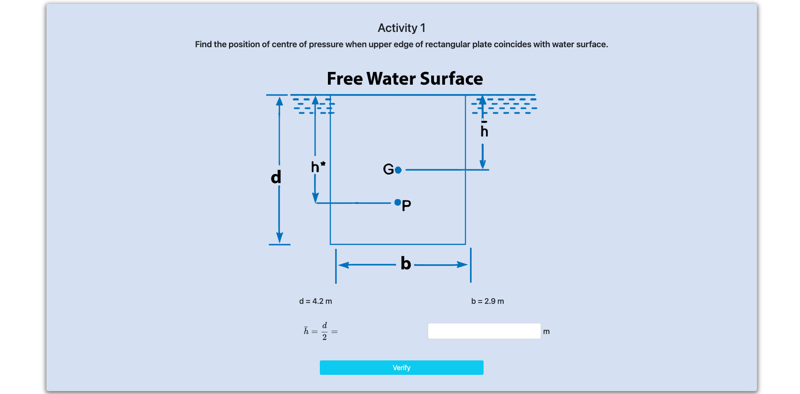
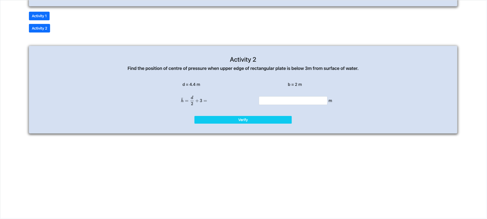
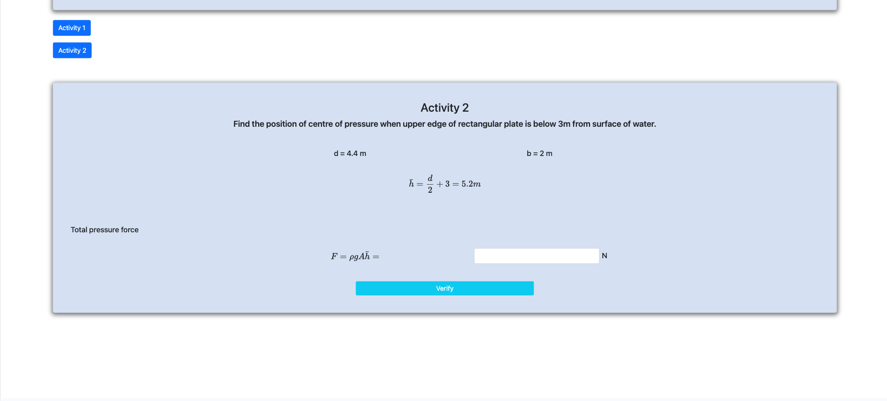
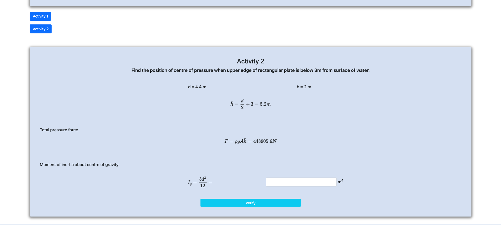
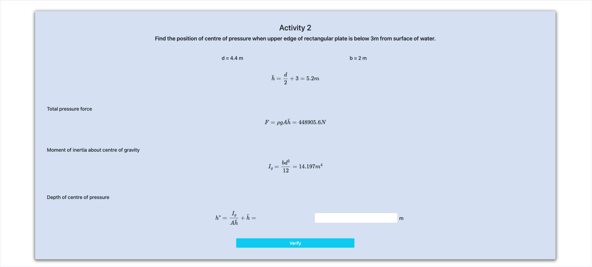

<h2>Follow the below steps to perform the experiment on the simulator</h2>
 

Step 1 : Click next to start.

Step 2 : Calculate h

Step 3 : Calculate total pressure force

Step 4 : Calculate moment of inertia about center of gravity

Step 5 : Calculate depth of centre of pressure

Step 6 : New Activity starts. Calculate h bar 

Step 7 : Calculate total pressure force 

Step 8 : Calculate moment of inertia about center of gravity

Step 9 : Calculate depth of centre of pressure

